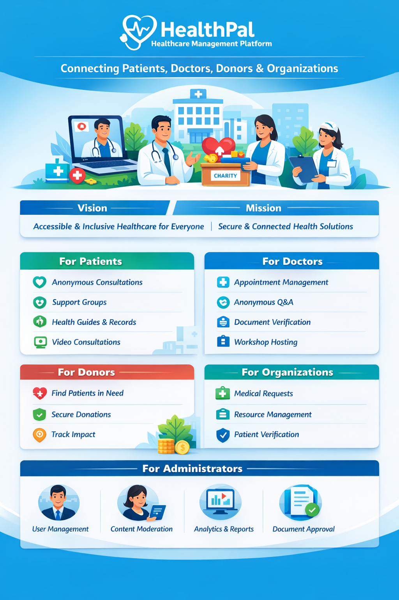

Welcome to the Advance-Software-Full-Project wiki!

# Project Overview

##  HealthPal - Healthcare Management Platform

HealthPal is a comprehensive healthcare management system designed to bridge the gap between patients, healthcare providers, donors, and medical organizations. The platform provides a unified ecosystem for health information sharing, medical consultations, support groups, and charitable donations.

---

##  Vision & Mission

**Vision**: To create an accessible, inclusive healthcare platform that empowers patients, connects healthcare providers, and facilitates medical assistance for those in need.

**Mission**: Provide a secure, user-friendly platform that:
- Enables seamless communication between patients and healthcare providers
- Facilitates anonymous health consultations
- Connects donors with patients in need
- Provides educational health resources
- Manages medical records securely
- Creates supportive communities through support groups

---

##  Key Features

### For Patients
- **Profile Management**: Comprehensive health profiles with medical history
- **Anonymous Messaging**: Ask health questions anonymously to doctors
- **Support Groups**: Join condition-specific support communities
- **Health Guides**: Access educational health content in multiple languages
- **Medical Needs**: Request medical assistance and donations
- **Document Management**: Upload and manage medical records
- **Video Consultations**: Real-time video calls with healthcare providers
- **Workshop Registration**: Attend health education workshops

### For Doctors
- **Professional Profiles**: Showcase specializations and credentials
- **Anonymous Consultations**: Respond to patient queries anonymously
- **Appointment Management**: Schedule and manage patient appointments
- **Document Verification**: Review and verify patient medical documents
- **Support Group Moderation**: Participate in support group discussions
- **Workshop Hosting**: Create and host educational workshops

### For Donors
- **Medical Needs Discovery**: Browse patients and organizations needing assistance
- **Donation Tracking**: Monitor donation history and impact
- **Secure Payments**: Safe and transparent donation processing

### For Organizations
- **Organization Profiles**: Hospitals, clinics, pharmacies, blood banks, charities
- **Medical Needs Posting**: Request supplies, equipment, or funding
- **Patient Verification**: Verify patient identities and medical needs
- **Resource Management**: Track inventory and donations

### For Administrators
- **User Management**: Oversee all user accounts and roles
- **Content Moderation**: Manage health guides, alerts, and workshops
- **Organization Verification**: Approve and manage healthcare organizations
- **Analytics Dashboard**: Monitor platform usage and statistics
- **Document Approval**: Review and approve patient verification documents

---
